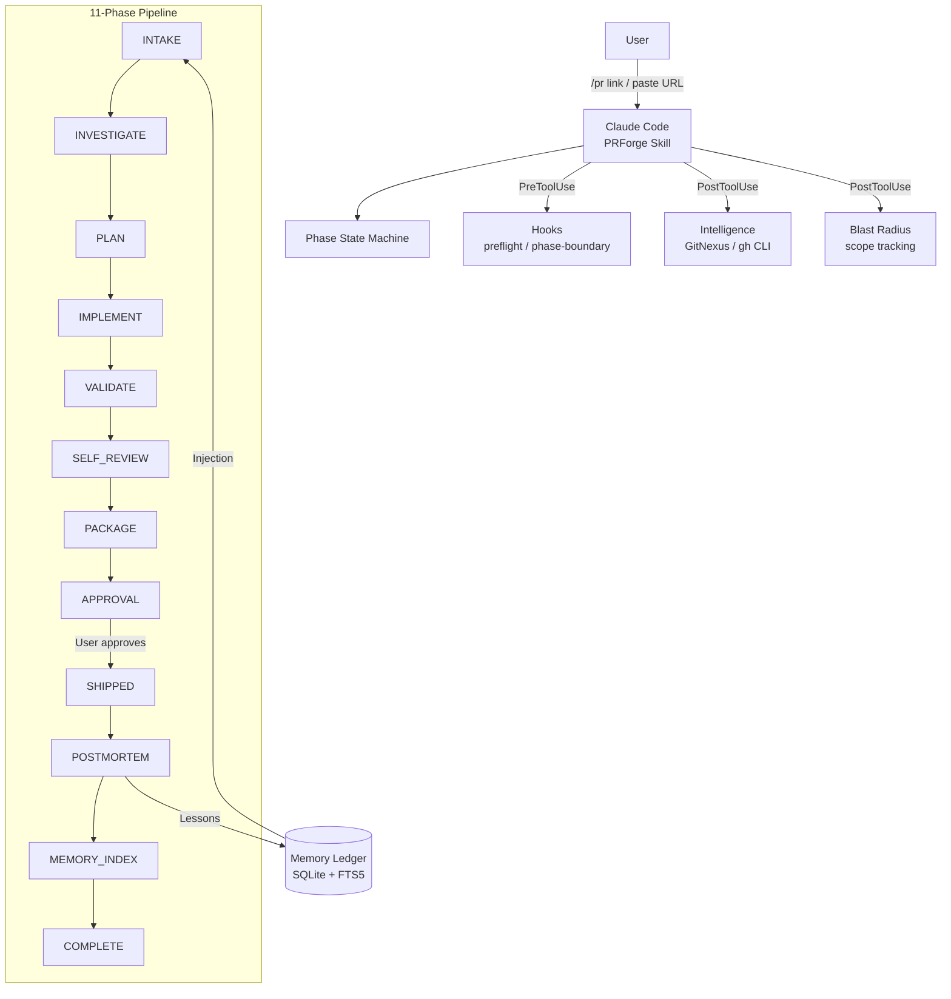
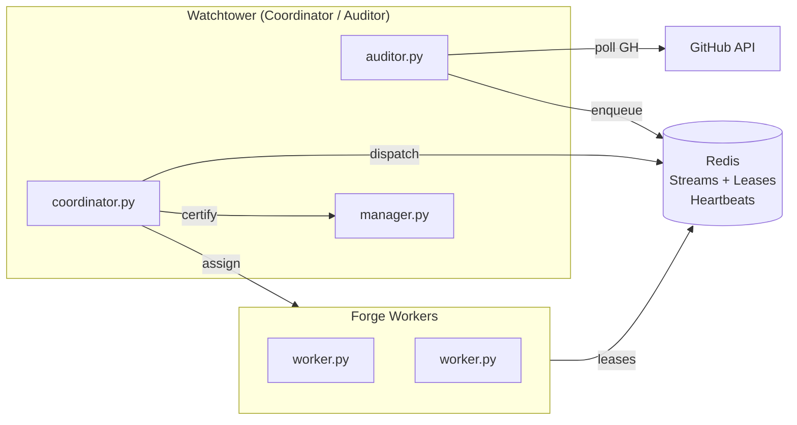

# PRForge (v1.5.0) — The Master Engineering Specification

**Professional PR contribution harness for Claude Code.**

PRForge is a multi-agent orchestration and safety harness that transforms Claude Code into a disciplined upstream contributor. It enforces repository intelligence, scope contracts, validation honesty, and git safety through a multi-layered mechanical enforcement system consisting of **11 canonical phases**, **13 repair states**, **10+ deterministic shell hooks**, and **3 background monitors**.

---

## 1. System Vision & Behavioral Model

PRForge operates on the **Gate-Scoped Autonomy** model. The agent is granted autonomy within a defined "capability envelope" per phase, but every tool call is intercepted by shell hooks to ensure alignment with repository intelligence and the PR contract.

### 1.1 Redirective Enforcement
Unlike prohibitive guardrails that simply block actions, PRForge **redirects** the agent. If a gate is violated (e.g., editing a file not in the contract), the system provides a JSON-based recovery path (a "Repair State") that instructs the agent on how to return to a valid state.

### 1.2 The "Total Blueprint" Mandate
This document represents a total technical map of the PRForge system. No detail from the codebase—from the atomic Redis-Lua leases to the granular phase-exit gates and RAG risk scoring—is omitted.

---

## 2. Capability Reference (Functional Overview)

1.  **Finds PR candidates** — fetches open issues, classifies them by type, and scores them by achievability (Scope size, Testability, Maintainer responsiveness, "Not Claimed").
2.  **Understands the repo before touching code** — GitNexus MCP for symbol graph/blast radius (`query`, `context`, `impact`, `detect_changes`) OR context-mode MCP (`search_codebase`, `find_references`, `run_tests`).
3.  **Decomposes feedback** — fetches and classifies EVERY reviewer concern (blocker, required_change, maintainer_preference, scope_reduction, optional_suggestion, misunderstanding, needs_user_decision, already_addressed).
4.  **Creates a PR Contract** — defines objective, required outcomes, allowed files, forbidden files/actions, and a validation plan with exact commands.
5.  **Generates Tamper-Proof DoD** — issue-specific checklist, hashed at PLAN time; evidence-verified at approval.
6.  **Enforces Plan Compliance** — at IMPLEMENT end, compares actual `git diff` against `patch_plan.md`.
7.  **Handles Incidental Fixes** — separates clearly broken items into their own commits; labels as `## Additional Fix` in the PR body.
8.  **Writes Missing Tests** — autonomously creates tests following repo patterns; only escalates on production-infrastructure requirements.
9.  **Runs Real Validation** — no fake claims. Every changed source file must have test coverage or a written justification in the `validation_ledger.md`.
10. **Self-Reviews Hostilely** — audits its own diff using a 10-question checklist for correctness, scope, hygiene, and artifact exclusion.
11. **Generates Maintainer-Grade Responses** — drafts PR bodies and review responses without AI attribution.
12. **Blocks Unsafe Git Actions** — prevents pushes to upstream, blind force-pushes, and WIP commits.
13. **Verifies Approval Integrity** — SHA256 hashes of diff, validation ledger, approval.md, and dod.md verified at SHIPPED time.
14. **Learns from Every PR** — automated `postmortem.json` generation and SQLite memory indexing (FTS5).
15. **Checks Review Freshness** — re-fetches comments and CI status before packaging; returns to INVESTIGATE if stale.
16. **Classifies CI Status** — distinguishes related check failures from pre-existing noise.
17. **Detects Branch Drift** — verifies the working branch is based on the expected upstream base before edits.
18. **Enforces Commit Hygiene** — blocks `Co-authored-by: Claude`, AI bylines, and WIP/debug commits.
19. **Auto-Excludes Artifacts** — writes `.prforge/` to `.git/info/exclude` automatically in Phase 0.
20. **Computes Approval Status** — `READY_TO_SHIP`, `READY_WITH_WARNINGS`, or `BLOCKED` based on validation and scope cleanliness.
21. **Previews Public Text** — exact posted text visible in the approval artifact before post.

---

## 3. Visual Architecture

### 3.1 Standalone Lifecycle

### 3.2 Distributed Mesh (LAN)

---

## 4. Command Reference (Exhaustive Reference)

### 4.1 Primary Workflow Commands
*   **`/pr <target>`**: Primary entry point. Normalizes input, detects task type (`new_pr`, `review_response`, `pr_polish`, `ci_fix`, `candidate_discovery`), and initializes `state.json`.
*   **`/pr-continue`**: Resumes work. Checks `inbox/job.json` (assigned mesh work) and `inbox/revision.json` (auditor requested fixes).
*   **`/pr-approve`**: High-integrity release gate. Verifies HMAC-SHA256 signatures and artifact re-hashes to detect drift.
*   **`/pr-rollback`**: Reset. Runs `git checkout .`, `git reset --hard HEAD`, and returns to the base branch.

### 4.2 Distributed Mesh (Horizontal Scaling)
*   **`/pr-distributed watchtower`**: Initializes PC1. Starts Redis (Port 6386) with auth and generates `mesh-secret`.
*   **`/pr-distributed forge <host> <code>`**: Registers worker node. SSH tunnel (Port 6386) to watchtower.
*   **`/pr-distributed manager-mode <level>`**: Sets authority: `off`, `certify_only`, `internal_actions`, `low_risk_public`.
*   **`/pr-distributed status`**: Real-time cluster health, node heartbeats, and job counts.
*   **`/pr-distributed off`**: Shuts down local mesh services and releases all active leases.

### 4.3 Vertical Mesh (Single-Machine Scaling)
*   **`/pr-distributed-local coordinator`**: Starts a local Redis instance (Ports 6380-6385) for multiple agents on one box.
*   **`/pr-distributed-local worker`**: Spawns a secondary worker with a unique ID and isolated worktree.

### 4.4 Engineering Memory Commands
*   **`/pr-memory status`**: DB stats (Runs, Artifacts, Events, Postmortems).
*   **`/pr-memory search --query <Q>`**: FTS5 search over evidence-backed lessons.
*   **`/pr-memory audit`**: Validates records and recurrence counters (active if >= 2).
*   **`/pr-memory index --postmortem 
`**: Manually ingests postmortem analysis into the ledger.
*   **`/pr-memory recall --repo <R>`**: Displays preflight lessons injected during INTAKE.

---

## 5. The 11-Phase Lifecycle (Quality Gates)

Transitions are gated by `hooks/phase-boundary.sh`. Illegal transitions (e.g., IMPLEMENT→APPROVAL) are hard-blocked.

### 5.1 canonical Phase Pipeline & Quality Gates

#### Phase 1: INTAKE
*   **Responsibility**: Context normalization & Memory injection.
*   **Entry Criteria**: Task type determined (new_pr, review_response, issue_fix, ci_fix, local_task, candidate_discovery); Repo identity confirmed (name, remotes, current branch); Intelligence mode detected (full_gitnexus / degraded_gh / degraded_local); `.prforge/` directory created; `.prforge/state.json` and `.prforge/task.json` written; Safety snapshot taken (`.prforge/snapshots/preflight.patch`).
*   **Exit Criteria**: Task normalized into `task.json` with type, source_url, objective; Permissions set: edit/test/commit = true, push/post/force_push = false; If review_response: review comments fetched and decomposed.
*   **Blockers**: Repo cannot be identified; Dirty tree contains unknown user edits; GitHub context cannot be fetched.

#### Phase 2: INVESTIGATE
*   **Responsibility**: Deep repo intelligence gathering.
*   **Entry Criteria**: Repo intelligence gathered (files, tests, CI, conventions); Related files and tests identified; Prior related PRs/issues checked (GitNexus or gh).
*   **Exit Criteria**: `.prforge/repo_intelligence.md` written; For review mode: `.prforge/review_decomposition.md` written with task queue; Risk areas identified.
*   **Blockers**: No relevant files found; No test path exists and no source-level proof possible.

#### Phase 3: PLAN
*   **Responsibility**: Scope contracting & DoD generation.
*   **Entry Criteria**: `.prforge/contract.md` exists (objective, required outcomes, allowed/forbidden changes, validation plan); `.prforge/patch_plan.md` written with per-file edit plan; Allowed files list is specific; Validation plan includes actual commands.
*   **Exit Criteria**: Contract and patch plan written; Scope boundaries clear; **`.prforge/dod.md` generated** with issue-specific, concrete, verifiable items (names specific files, functions, test commands; test items include exact command and expected pass count).
*   **Blockers**: No minimal change path identified; No validation path exists; Contract is too broad; `dod.md` not generated or contains placeholder text.

#### Phase 4: IMPLEMENT
*   **Responsibility**: Surgical code edits & missing test creation.
*   **Entry Criteria**: Code changes complete; All changed files within contract scope; No unrelated changes (formatting churn, dependency additions, scope creep); Each changed file has clear explanation.
*   **Exit Criteria**: Diff reviewed against contract scope; No files outside allowed list touched; Code follows existing style/patterns; **Plan compliance check run** (`patch_plan.md` vs `git diff`); Every changed non-test source file has a corresponding test file touched or justified; **Commit hygiene: NO Co-authored-by, AI bylines, WIP, debug, or temp commits.**
*   **Blockers**: Files outside contract modified; Dependency added without approval; Formatting-only changes mixed with logic changes; Planned files not touched; Untested source changes; **Review items not addressed** (review_response mode); **Commit hygiene violations**.

#### Phase 5: VALIDATE
*   **Responsibility**: Execution of the validation plan.
*   **Entry Criteria**: All validation commands from the contract's validation plan were run; `.prforge/validation_ledger.md` written with honest results; No fake validation.
*   **Exit Criteria**: Validation ledger is honest and complete; All critical tests pass; Any failures are explained.
*   **Blockers**: Validation commands were not actually run; Validation ledger contains fabricated results; Critical tests fail without explanation.

#### Phase 6: SELF_REVIEW
*   **Responsibility**: Hostile self-audit & hygiene check.
*   **Entry Criteria**: Hostile review completed using `references/hostile-review-checklist.md`; `.prforge/hostile_review.md` written; All "no" or "unclear" answers addressed.
*   **Exit Criteria**: Hostile review verdict is PASS; Edge cases handled or documented; **Hostile review covers all required review items** (each required_change/blocker item has a corresponding finding).
*   **Blockers**: Hostile review found unresolved correctness issues; Alternate code paths might be broken; Tests missing for core fix.

#### Phase 7: PACKAGE
*   **Responsibility**: Review freshness check & PR body generation.
*   **Entry Criteria**: `.prforge/pr_body.md` or `.prforge/review_response.md` written; PR body only includes validation commands that were actually run; `.prforge/approval.md` written; Every item in `.prforge/dod.md` is either checked or has a documented exception.
*   **Exit Criteria**: Approval artifact is complete and scannable; Preflight check passes; Branch tracks correct remote (fork, not upstream); `dod.md` status table populated in `approval.md`.
*   **Blockers**: Preflight check fails; PR body contains un-run validation claims; Branch tracks wrong remote; `dod.md` has unchecked items.

#### Phase 8: APPROVAL
*   **Responsibility**: Human sign-off & integrity fingerprinting.
*   **Entry Criteria**: User explicitly approved the action; Approved action matches what's in `approval.md`.
*   **Exit Criteria**: Action executed exactly as approved; `state.json` phase updated to SHIPPED (via `/pr-approve`).

#### Phase 9: POSTMORTEM
*   **Responsibility**: (Auto) Lifecycle analysis & evidence capture.
*   **Entry Criteria**: Run SHIPPED; Terminal snapshot captured (`terminal_snapshot.py`).
*   **Exit Criteria**: `postmortem.json` generated with Summary, Evidence, and Tags.

#### Phase 10: MEMORY_INDEX
*   **Responsibility**: (Auto) Lesson extraction & SQLite/FTS5 indexing.
*   **Entry Criteria**: POSTMORTEM complete; Artifacts verified.
*   **Exit Criteria**: Memory records created/updated; FTS5 index rebuilt.

#### Phase 11: COMPLETE
*   **Responsibility**: Resource cleanup.
*   **Exit Criteria**: All locks and Redis leases released.

---

## 6. The 13 Repair States (Automated Redirection)

| State | Triggering Condition | Required Action |
|-------|----------------------|-----------------|
| **SCOPE_RECONCILE** | `git diff` touches files not in `contract.md`. | Revert extra files OR expand contract. |
| **STATE_SYNC_REPAIR**| `state.json` in-memory != on-disk. | Re-read `state.json` or sync to disk. |
| **LEASE_RENEWAL_REPAIR**| Redis mesh lease expired (TTL reached). | Re-acquire lease via `meshctl`. |
| **REVIEW_REFRESH** | New maintainer comments mid-run. | Re-run INVESTIGATE to classify new items. |
| **SCOPE_UPDATE** | Changes require contract expansion. | Update `contract.md` and re-hash `dod.md`. |
| **PLAN_UPDATE** | `dod.md` hash mismatch or patch invalidated. | Regenerate plan and DoD artifacts. |
| **VALIDATION_REPAIR** | Test failures in changed source area. | Fix bug or update test expectations. |
| **INTELLIGENCE_REPAIR**| GitNexus MCP became unavailable mid-run. | Document degraded intel & fallback. |
| **ARTIFACT_REPAIR** | Mandatory artifact (e.g., `dod.md`) deleted. | Re-generate missing artifact. |
| **COORDINATOR_RECONCILE**| Mesh worker/coordinator mismatch. | Verify role assignment in Redis. |
| **STYLE_REPAIR** | Formatter or linter failure. | Run `lint --fix` or `format`. |
| **COMMIT_REPAIR** | Hygiene violation or author mismatch. | Fix commit message or author identity. |
| **POLL_CI** | Waiting for GitHub Actions status. | Periodically check `gh pr checks`. |

---

## 7. Deterministic Hook Reference

Hooks are the system's mechanical enforcement layer, registered via `.claude-plugin/hooks/hooks.json`.

### 7.1 PreToolUse (Safety & Gating)
*   **`preflight.sh` (Bash)**: Intercepts `git push`, `gh pr`, `git commit`.
    *   Blocks push to `upstream`. Hard-blocks `--force` (only `--force-with-lease`).
    *   Blocks commits with "WIP", "debug", "Claude Code", or "Generated by".
    *   Verifies `CURRENT_DIFF_HASH` matches `approval.md` fingerprint.
*   **`phase-gate-enforcer.sh` (Bash)**: Restricts tool usage by phase.
    *   Example: No `Write` allowed in INVESTIGATE; no `gh pr` allowed before APPROVAL.
*   **`mesh-lock-guard.sh` (Bash/Write/Edit)**: Enforces distributed write-locks.
    *   Verifies node holds an active Redis `lease:path` for the file being edited.
*   **`phase-boundary.sh` (Write)**: Intercepts `state.json` updates.
    *   Validates requested phase transitions against the allowed state machine.
    *   **Loop Detector**: Circuit breaker blocks transitions after 3 consecutive failures.

### 7.2 PostToolUse (Intelligence & Automation)
*   **`memory-autocapture.sh`**: Post-Bash/Write/Edit.
    *   Logs every state-changing tool call and registers resulting artifacts in the SQLite ledger.
*   **`gitnexus-intelligence.sh`**: Post-Read.
    *   Auto-discovers GitNexus/context-mode MCP servers.
    *   Injects symbol-mapping instructions into `repo_intelligence.md`.
*   **`blast-radius.sh`**: Post-Write/Edit.
    *   Computes `changed_files`, `test_ratio`, `dependency_depth`, `api_touched`.
    *   Updates the real-time risk score in `state.json`.
*   **`phase-injector.sh`**: Post-Write.
    *   Detects `phase` changes and injects the new playbook Markdown into the model's context.
*   **`discipline-check.sh`**: Post-Write.
    *   Runs `discipline-check.py` to enforce Karpathy-grade surgical edit standards.

---

## 8. Security & Safety Invariants (The Rules)

PRForge enforces 13 non-negotiable safety rules through mechanical gates.

### 8.1 Core Safety Rules
1.  **Rule 1: Never Push Blindly** — Always run `git status`, `git branch -vv`, `git remote -v`, `git log --oneline -8`, and `git diff --stat` before any push. Verify branch, remote, and diff match expectations.
2.  **Rule 2: Force-With-Lease** — Never use raw `--force`. `--force-with-lease` is required to protect collaborator work. Destructive force-pushes MUST have explicit user approval in `approval.md`.
3.  **Rule 3: Test Honesty** — Never claim tests passed unless actually run. Every `validation_ledger.md` entry must correspond to an actual CLI execution. Fake validation is a BLOCKER.
4.  **Rule 4: Scope Lockdown** — Edits outside `contract.md` allowed files are detected by the Write hook and trigger `SCOPE_RECONCILE`. Revert or expand contract before proceeding.
5.  **Rule 5: No AI Attribution** — `commit-msg` hook strips `Co-authored-by: Claude`, AI bylines, and "Generated by Claude Code". Commits must use the configured human Git identity.
6.  **Rule 6: Artifact Separation** — All state/plans live in `~/.prforge/runs/`. The target repo contains only a `.prforge-run` pointer, which is automatically added to `.git/info/exclude`.
7.  **Rule 7: Never Publish Without Approval** — Push, PR creation, review comments, and labels ALL require explicit human "yes". silence or "looks right" does NOT count as approval.
8.  **Rule 8: DoD Tamper Proof** — `dod.md` is SHA256 hashed at PLAN generation. Any manual edit to the checklist invalidates the entire run, forcing a restart from PLAN.
9.  **Rule 9: Finality Rule** — Every public response (PR body, review comment) MUST include the contributing commit hash at the top: `**Commit:** <sha> (<short-sha>)`.
10. **Rule 10: Hostile Self-Review** — Must pass the 10-question hostile review (`references/hostile-review-checklist.md`) with a PASS verdict. No "all good" summaries without per-item evidence.
11. **Rule 11: No shipping with BLOCKED status** — Dirty scope, failed tests in touched area, or stale reviews block shipping. Blocking conditions cannot be overridden.
12. **Rule 12: Ownership Ambiguity** — If PR ownership is unclear, enter read-only mode and confirm via `gh api user` before enabling destructive actions.
13. **Rule 13: No Hidden Public Text** — Exact posted text MUST be visible in `approval.md` for verbatim verification before it is posted to GitHub.

### 8.2 Coding Discipline ( Karpathy Mandates )
If `andrej-karpathy-skills` is not present, the built-in fallback enforces:
- **Think Before Coding**: State assumptions and minimal change path before any edit.
- **Simplicity First**: Smallest correct fix > architectural cleanup. No new abstractions unless necessary.
- **Surgical Changes**: Every edited line must map to a requirement. No renames or modernization of unrelated code.
- **Goal-Driven Execution**: No "while I'm here" refactors or style cleanups.

### 8.3 Git Disaster Recovery
If git state is corrupted (Detached HEAD, Branch Diverged, Wrong Base), the system redirects to `phases/blocked.md` for recovery:
- **Branch Behind**: Recommend `git pull --rebase`.
- **Diverged**: Recommend `git rebase` or `git reset`.
- **Accidental Edit on Main**: Recommend `git stash` and move to feature branch.

---

## 9. Distributed Mesh Protocol (Redis-Lua)

Coordinated via Redis Streams and atomic Lua scripts for zero-race-condition multi-agent dispatch.

### 9.1 Key Redis Schemas (`Workflow:<cluster>:`)
*   **SET `Workflow:<c>:nodes`**: All registered node IDs.
*   **HASH `Workflow:<c>:node:<node_id>`**: Node state, heartbeat, and capability registration.
*   **HASH `Workflow:<c>:job:<job_id>`**: Full job state, phase, and artifact signatures.
*   **HASH `Workflow:<c>:pr:<slug>:<n>`**: Auditor cursor state (Last SHA, Last Review, Last Checks).
*   **STREAM `Workflow:<c>:stream:jobs:pending`**: Durable job queue for workers.
*   **STREAM `Workflow:<c>:stream:events`**: Audit event log for cluster-wide observability.
*   **ZSET `Workflow:<c>:audit_budget`**: Timestamps of LLM audits for hourly rate-limiting.
*   **PUBSUB `Workflow:<c>:notify`**: Real-time cluster-wide desktop notifications.

### 9.2 Auditor Cursor Semantics (roles/auditor.md)
The auditor uses three independent cursors to implement the **Skip-if-unchanged invariant**:
- **`last_review_cursor`**: SubmittedAt of the latest processed external review. Prevents duplicate review response jobs.
- **`last_checks_hash`**: Stable normalized hash of CI check state (Sorted by name: Conclusion + Status + URL).
- **`last_audited_head_sha`**: Head SHA at the time of the last `audit_only` job.
- **LLM Audit Budget**: `ZCOUNT` check against `max_llm_audits_per_hour` before enqueuing speculative jobs.
- **`medium_idle_only`**: Medium-severity polish jobs are ONLY queued when zero P0/P1 high-priority pressure exists in the stream or active set.

### 9.3 Worker Lease Management (roles/worker.md)
Workers renew all four leases every 15s (Heartbeat interval):
1.  **`lease:job:<id>`**: Job ownership lock.
2.  **`lease:pr:<repo>:<pr>`**: Uniqueness lock per pull request.
3.  **`lease:branch:<repo>:<branch>`**: Branch uniqueness lock.
4.  **`lease:worker:<node_id>`**: Busy lock for the worker node itself.
*   **Heartbeat TTL**: Node keys expire after `HB_INTERVAL * 3` missed heartbeats.

### 9.4 Checkout Broker & Isolated Worktrees
Managed by `checkout_broker.py`, workers follow a strict isolation protocol:
1.  **Bare Repository Cache**: One bare clone per repo stored in `~/.prforge/repos/`.
2.  **Isolated Worktree Spawn**: Each assigned job gets a fresh directory via `git worktree add` in `~/.prforge/worktrees/`.
3.  **Forensic Quarantine**: Dirty/aborted worktrees are moved to `~/.prforge/quarantine/` for audit instead of being deleted.

### 9.5 Manager Mode Authority Levels
- **`off`**: Standalone behavior.
- **`certify_only`**: Dual-signature verification (Auditor + Coordinator), no public actions.
- **`internal_actions`**: Manager can release leases, requeue jobs, or block runs.
- **`low_risk_public`**: Permission to `push`, `comment`, and `request_review`. Never `merge` or `force_push` to upstream.

---

## 10. Intelligence & RAG Engine

PRForge uses intelligence in two paths: the **Information Path** (selecting context for the agent) and the **Enforcement Path** (triggering deterministic gates and risk signals).

### 10.1 Intelligence Hierarchy
1.  **GitNexus MCP**: Primary for 360° symbol views (`context`), blast radius (`impact`), and diff mapping (`detect_changes`).
2.  **Context-Mode MCP**: Primary for project-wide search (`search_codebase`) and automated validation (`run_tests`).
3.  **Local Fallback**: Automatically reverts to `rg`, `find`, `git log`, and `gh` CLI with a "Degraded Intelligence" warning and sets `minimum_risk_floor` to MEDIUM.

### 10.2 RAG Intel Engine (`intel_engine.py`)
Uses local **FastEmbed** (CPU-optimized) for risk detection:
*   **Recall**: `BAAI/bge-small-en-v1.5` embeddings over current run artifacts.
*   **Precision**: `Xenova/ms-marco-MiniLM-L-6-v2` cross-encoder reranking pass.
*   **Scoring**: Combines cosine similarity (35%) and rerank scores (65%). Risks > 0.80 trigger automated redirects.

### 10.3 Local vs. Mesh Intel Split
- **Mesh Intel (Global)**: Owns cross-PR memory, global artifact index, audit prioritization, and cluster-wide policy decisions.
- **Local Intel (Worker)**: Owns current run context, cached policy bundle, local risk signals, and fast recoverable redirects.

### 10.4 Fail-Safe Behavior Matrix
- **Mesh Intel Down**: Local adaptive enforcement continues from cached policy bundle.
- **Local Intel Down**: Deterministic gates continue; ambiguous cases escalate to the human.
- **Redis Down**: Current safe local work continues; risky transitions (phases/public actions) wait for reconnect.
- **FastEmbed/Reranker Down**: Adaptive enforcement is disabled; deterministic safety gates remain active.

### 10.5 Policy Decision Schema
Decisions from `prforge_mesh.py policy-check` follow a strict schema:
- `decision`: `allow`, `warn`, `redirect_recoverable`, or `escalate`.
- `redirect_state`: (e.g., `VALIDATION_REPAIR`) The repair phase to enter.
- `required_next_action`: High-fidelity instruction for the agent (e.g., "Add regression test for malformed parser input").

---

## 11. Engineering Memory (4-Layer)

PRForge converts ephemeral feedback into durable engineering knowledge through a multi-layered persistence architecture.

### 11.1 The 4-Layer Architecture
1.  **Layer 0 (Raw Truth)**: Artifact trail on disk under `~/.prforge/runs/`. Contains `github/`, `git/`, and `agent/` subdirectories.
2.  **Layer 1 (The Ledger)**: SQLite database (~/.prforge/memory_ledger.db).
    - **`runs`**: Primary log of every PRForge execution.
    - **`artifacts`**: Registry of every file produced (Contract, DoD, Ledgers).
    - **`events`**: Append-only log of every tool call and phase transition.
3.  **Layer 2 (The Analysis)**: Structured `postmortem.json` summarizing:
    - **Outcome**: (MERGED, CLOSED, ABANDONED).
    - **Success Signal**: CI pass rate and maintainer sentiment.
    - **Evidence**: Specific quotes from reviews and failure patterns from CI.
4.  **Layer 3 (Lessons)**: Scoped, searchable memory records.
    - **Indexing**: Uses SQLite FTS5 for high-performance retrieval.
    - **Scoping**: Lessons are tagged by `repo`, `subsystem`, and `file_glob`.

### 11.2 Lesson Promotion Logic (`memory_indexer.py`)
Lessons are promoted through a formal lifecycle to ensure only high-confidence evidence reaches the agent:
- **Candidate**: A single observation from a postmortem.
- **Inferred**: Maintainer preferences (e.g., "prefer snake_case here") extracted from reviews.
- **Active**: Promoted when `recurrence_count >= 2` AND `confidence == high`.
- **Global**: Lessons verified across multiple independent repositories.

### 11.3 Preflight Injection
During the INTAKE phase, the system queries the FTS5 index for lessons matching the current repo and objective. These are injected into the agent's context as **"Lessons from Prior Runs"**, preventing the recurrence of previous mistakes or maintainer objections.

---

## 12. Technical Component Encyclopedia

### 12.1 Core Scripts (`scripts/`)
- **`prforge_state.py`**: Implementation of locked atomic read/write for `state.json`. Uses file locks to prevent race conditions during concurrent tool calls.
- **`terminal_snapshot.py`**: Evidence capture engine. Runs before POSTMORTEM transition; captures `pr.json`, `review-comments.jsonl`, `ci-runs.jsonl`, `final.diff`, and `commits.jsonl`.
- **`postmortem_generator.py`**: Analytical summarizer. Correlates CI failures and review quotes to extract "Could be better" and "Avoid next time" signals.
- **`memory_ledger.py`**: SQL interface for the PRForge persistent memory. Manages the SQLite schema, FTS5 rebuilding, and artifact registration.
- **`memory_indexer.py`**: High-level memory manager. Implements lesson promotion logic (Candidate → Inferred → Active) based on recurrence counters.
- **`validate_phase_machine.py`**: Consistency sentinel. Verifies that the state machine definition is coherent across SKILL.md, bash hooks, and phase playbooks.

### 12.2 Deployment & Sync (`/`)
- **`remote-deploy.sh`**: Production deployment script. Uses rsync to push the plugin to remote hosts (e.g., 10.9.66.198) and surgically updates remote `.claude` profile settings and marketplaces.
- **`sync.sh`**: Development synchronization. Mirroring the codebase to multiple local OpenRouter/Claude Code profiles for testing.

### 12.3 Mesh Coordination (`scripts/mesh/`)
- **`coordinator.py`**: The cluster's central dispatcher. Handles node discovery, lease acquisition, and reliable job assignment via Redis Streams.
- **`auditor.py`**: The cluster's "eyes." Polls the GitHub API every 15m; implements cursor-based change detection to prevent redundant work.
- **`worker.py`**: The local agent daemon. Sends 15s heartbeats, renews leases, and writes `inbox/job.json` to trigger agent activity.
- **`manager.py`**: The authority layer. Implements the dual-signature verification protocol (HMAC-SHA256) for public action certification.
- **`policy_engine.py`**: Decision logic. Correlates deterministic safety gates with advisory signals from the RAG Intel Engine.
- **`intel_engine.py`**: The local RAG implementation. Manages FastEmbed CPU-optimized vector indices and cross-encoder reranking.
- **`checkout_broker.py`**: Infrastructure manager. Handles isolated `git worktree` lifecycles and quarantine management for aborted jobs.
- **`mesh_signing.py`**: Cryptographic utility. Implementation of HMAC-SHA256 signing for all verdict and certification JSON artifacts.

### 12.4 Shell Hooks (`hooks/`)
- **`preflight.sh`**: Critical safety sentinel. Intercepts bash commands to block unsafe pushes, force-pushes, and WIP commits.
- **`phase-boundary.sh`**: Pipeline enforcer. Intercepts `state.json` writes to validate state transitions and prevent phase-skipping.
- **`blast-radius.sh`**: Automated risk assessor. Computes files-changed, test-ratio, and dependency-depth after every edit.
- **`discipline-check.sh`**: Static analyzer. Verifies Karpathy-grade behavioral compliance (surgical edits, simplicity).
- **`memory-autocapture.sh`**: Forensic logger. Automatically registers every tool call and file artifact in the memory ledger.
- **`prforge-common.sh`**: Shared utility library. Logic for slug resolution, state-directory discovery, and atomic file locking.

### 12.5 Background Monitors (`monitors/`)
- **`local-watch.sh`**: Session sentinel. Watches for Git drift (HEAD movement), untracked artifacts, and approval integrity.
- **`distributed-worker-watch.sh`**: Node sentinel. Watches for assigned jobs in Redis and ensures heartbeats/leases are active.
- **`distributed-coordinator-watch.sh`**: Cluster sentinel. Prunes dead nodes and requeues abandoned jobs in the pending stream.

---

## 13. Behavioral Reference & Policy Manual

### 13.1 Hostile Review Checklist (The 10 Invariants)
Agents must answer these questions in `hostile_review.md` before advancing to PACKAGE.
1.  **Correctness**: Does this solve the actual problem stated in the contract? Does it handle edge cases?
2.  **Regressions**: Are there alternate code paths (auth types, provider configs) that this might break?
3.  **Scope**: Did I touch only allowed files? Did I avoid unrelated cleanup or "while I'm here" changes?
4.  **API Integrity**: Did I avoid changing public API signatures or config precedence chains?
5.  **Test Coverage**: Does every changed source file have corresponding test changes? Do tests actually fail without the fix?
6.  **Stale Tests**: If a test file exists for a changed source, was it updated to match new logic?
7.  **Validation Honesty**: Did I record real outputs in `validation_ledger.md`? Does the PR body match actual validation results?
8.  **Git Safety**: Is the branch tracking the fork (origin), not the upstream? Is the history free of WIP commits?
9.  **Maintainer Perception**: Would a maintainer consider this small (5-min review)? Is the language non-defensive?
10. **Hygiene**: Are there NO Co-authored-by trailers, AI bylines, or AI-assisted footers in commits?

### 13.2 Review Item Classification
Reviewer concerns are fetched and decomposed into these mandatory categories:
- **`blocker`**: Prevents merge; must be addressed with code changes.
- **`required_change`**: Expected by maintainer; must be addressed.
- **`maintainer_preference`**: Advice on style or pattern; should be followed.
- **`scope_reduction`**: Maintainer flagged a change as unnecessary; must be reverted.
- **`optional_suggestion`**: Non-binding idea; agent chooses whether to implement.
- **`needs_user_decision`**: Ambiguous feedback; agent MUST escalate to human in `approval.md`.
- **`already_addressed`**: Feedback that is already reflected in the latest diff.

### 13.3 Candidate Discovery Scoring
Points are assigned based on these achievability signals:
- **Scope Size**: Estimated files changed (Smaller = Higher Score).
- **Testability**: Presence of existing test suite and local reproducibility.
- **Maintainer Acceptance**: Existence of maintainer comments confirming the bug or approving the feature.
- **Dependency Risk**: Avoidance of core auth paths or massive dependency updates.
- **Repo Responsiveness**: Recent merged PR activity (High Activity = Higher Score).

---

## Version History
- **v1.5.0**: Total Convergence. Integrated RAG, SQLite Memory, 11-Phase/13-Repair Machine, 10 Hooks, Redis-Lua Mesh.
- **v1.4.0**: Durable storage & phase reconciliation.
- **v1.3.0**: Distributed Mesh MVP.
- **v1.1.0**: Tamper-proof DoD.
- **v1.0.0**: Initial release.
