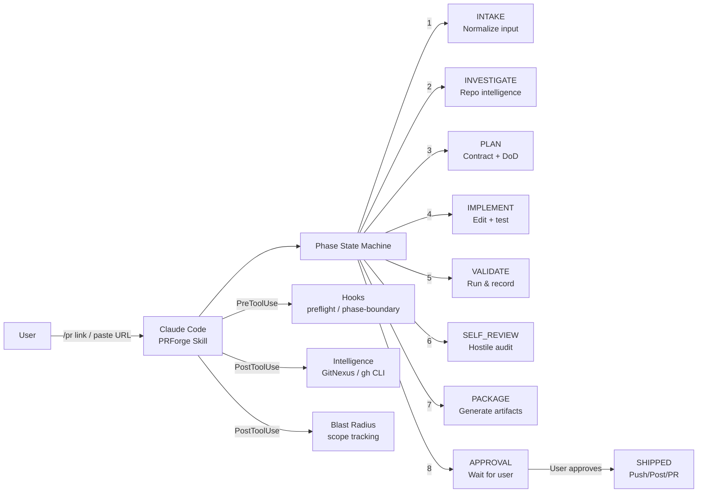
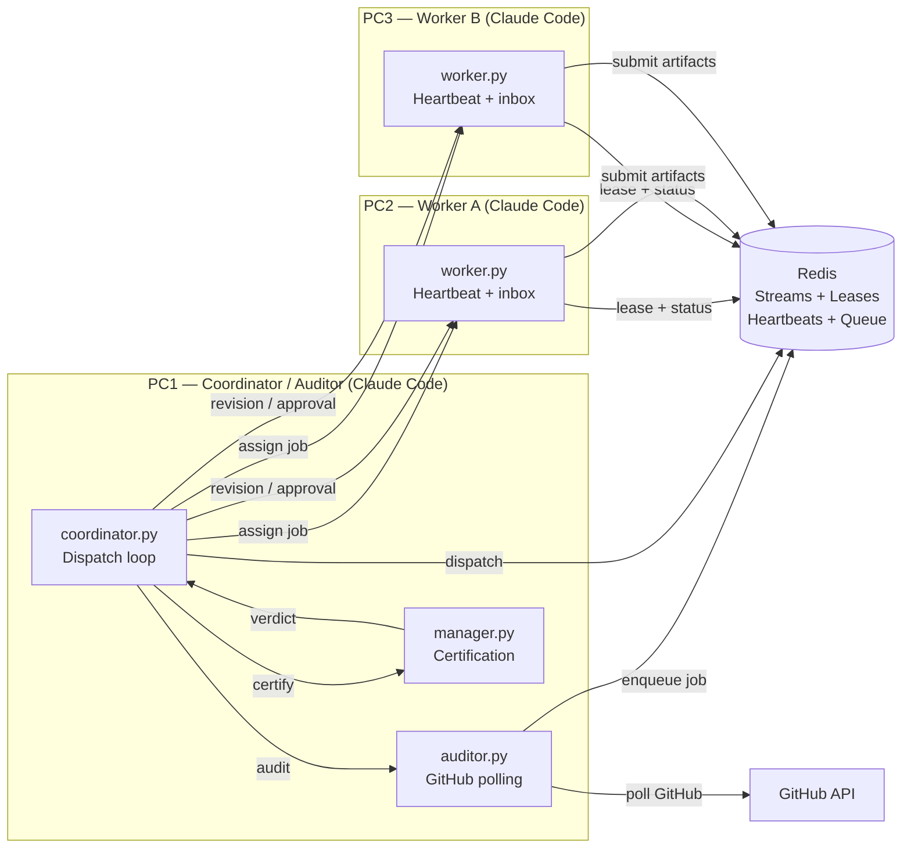

# PRForge

**Professional PR contribution harness for Claude Code.**

PRForge turns the agent into a disciplined upstream contributor. It enforces repo
intelligence, scope contracts, validation honesty, and git safety before any
upstream-facing action through a multi-layered constraint system.

**Audit note:** This is a redirective enforcement system — when the model goes off-track,
it's redirected back to the correct phase with a clear recovery path, rather than
simply blocked. This produces high-margin behavior for well-aligned models,
with some gaps documented in "Known Limitations" below.

## The Model

**Delegated execution with guarded release.**

```
You give it:  repo name / issue link / PR link / review link / task description
It does:      investigate → plan → patch → validate → self-review → package
It returns:   "Here is exactly what I changed and what you are approving."
You approve:  push / comment / create PR
```

The agent handles the full local workflow autonomously. It only stops for your
approval when the result is about to become public or irreversible.

---

## Quick Start

```bash
# Find contribution candidates in a repo
"find PR candidates in fastapi/fastapi"

# Fix a GitHub issue
/pr https://github.com/org/repo/issues/123

# Address review feedback on your PR
/pr https://github.com/org/repo/pull/456

# Resume a blocked or interrupted run
/pr-continue

# Approve and ship (verifies integrity hashes first)
/pr-approve
```

---

## What It Does

1. **Finds PR candidates** — given a repo name, fetches open issues, classifies them by type (bug, auth/oauth, integration, docs, perf, refactor, test, etc.), scores each by achievability (scope clarity, maintainer consensus, local testability, repo responsiveness, not-claimed), and presents ranked options grouped by category. Waits for your selection. Topic area (auth, oauth, etc.) is never a reason to avoid a candidate — complexity and unresolved decision-making are.

2. **Understands the repo before touching code** — GitNexus MCP for symbol graph/blast radius (`query`, `context`, `impact`, `detect_changes`), `gh` CLI for PR/issue history and CI status, firecrawl skill for external docs and rendered CONTRIBUTING.md. Falls back to `rg`/`git log`/`gh` and records exactly which capabilities were unavailable.

3. **Decomposes review feedback completely** — every reviewer concern is fetched, classified (blocker / required_change / maintainer_preference / scope_reduction / optional_suggestion / misunderstanding / needs_user_decision / already_addressed), and tracked as a required gate. Nothing gets left unaddressed. Ambiguous items are surfaced in the approval artifact for your decision — never auto-fixed.

4. **Creates a PR Contract before any edits** — objective, required outcomes, allowed files, forbidden files/actions, and a validation plan with exact commands. Edits outside the contract are immediately classified as scope delta by the Write hook and must be reverted or the contract/DoD regenerated before validation or approval can proceed.

5. **Generates a tamper-proof Definition of Done** — written at PLAN time from the contract and patch plan, hashed immediately. Every item is issue-specific and concrete (names exact files, functions, test commands). At approval, each checked item must have corroborating evidence in `git diff`, `validation_ledger.md`, or `review_decomposition.md`. If `dod.md` was edited after generation, the entire run is invalidated.

6. **Enforces plan compliance** — at end of IMPLEMENT, compares actual `git diff` against `patch_plan.md`. Planned files not touched: finish the work. Files touched outside the plan: remove or update the contract first, then continue.

7. **Handles incidental fixes correctly** — if the agent finds a clearly broken thing while working, it fixes it in a separate commit, labels it `## Additional Fix` in the PR body. Refactors, cleanup, and "while I'm here" improvements are deferred to `hostile_review.md` and left alone.

8. **Writes missing tests itself** — missing tests are not escalated to you; the agent creates them following repo patterns. Only escalates if the test environment requires production data, secrets, or infrastructure unavailable locally.

9. **Runs real validation** — no fake test claims, no "should pass." Either ran and passed, or not run with a documented reason. Every changed source file must have test coverage or a written justification.

10. **Self-reviews hostilely** — audits its own diff as if trying to reject it before the maintainer can. Scope, correctness, alternate code paths, test quality, commit hygiene, artifact exclusion.

11. **Generates maintainer-grade PR descriptions** — honest validation records, scope boundaries, risk notes. No "Generated by Claude" anywhere.

12. **Triages review comments and drafts professional responses** — no defensiveness, no over-explaining, no arguing. Acknowledge, fix, move on.

13. **Blocks unsafe git actions** — blind push, force-push without approval, pushing to upstream instead of fork, pushing while approval is stale.

14. **Verifies approval integrity** — SHA256 hashes of diff, validation ledger, approval.md, and dod.md recorded at approval time. `/pr-approve` verifies all four before executing anything. If the code changed, approval is stale and regenerated. If dod.md was edited, the entire run restarts from PLAN.

15. **Checks review freshness** — re-fetches PR comments and CI status before packaging. If new reviewer comments or new check failures appeared since the last fetch, returns to INVESTIGATE to classify them.

16. **Classifies CI/check status** — distinguishes checks that are related to changed files vs. unrelated pre-existing failures. Surfaces pending checks. Never buries a related failure.

17. **Detects branch/base drift** — verifies the working branch is still based on the expected upstream base before any edits. Classifies: current / behind but safe / diverged needs rebase / wrong base.

18. **Enforces commit hygiene** — `commit-msg` hook (auto-installed in Phase 0) blocks: `Co-authored-by: Claude/Opus/Sonnet/Haiku/Anthropic`, "Generated by Claude", AI-assisted footers, WIP/debug/temp/fixup commit names. `pre-commit` hook independently blocks staged `.prforge/` artifacts. Commits must use the configured human Git identity (`git config user.name`/`user.email`). `gh api user` is used for GitHub ownership and PR checks only — these are separate identities.

19. **Auto-excludes `.prforge/` from git** — writes `.prforge/` to `.git/info/exclude` on every Phase 0 activation. Pre-commit hook independently blocks staged `.prforge/` artifacts at commit time.

20. **Computes approval status** — `READY_TO_SHIP` / `READY_WITH_WARNINGS` / `BLOCKED` based on validation results, CI classification, scope cleanliness, review freshness, test coverage, and DoD evidence.

21. **Previews exact public text** — the precise PR body or review response that will be posted is visible in the approval artifact before you approve. No surprises.

---

## Implicit Activation

PRForge activates from a `/pr` command, natural language trigger phrases, or pasted GitHub links. **No explicit command needed.**

If you paste a PR link that has review comments on it, PRForge automatically activates in `review_response` mode. It identifies you via `gh api user`, confirms PR ownership, and goes to work collecting every reviewer concern.

---

## Candidate Discovery

Point it at one or more repos — no issue link needed:

```
"find PR candidates in rust-lang/rust"
"find good first issues in fastapi/fastapi"
"what oauth issues are open in supabase/supabase"
```

The agent:
1. Fetches open issues with `gh issue list` — filters by label, recency, and maintainer engagement
2. Classifies each issue by PR type
3. Scores each by achievability
4. Checks repo health signals (CONTRIBUTING.md exists, recent merged PRs, maintainer response rate)
5. Filters out claimed, stale, blocked, or decision-dependent issues
6. Presents ranked candidates grouped by type

**PR types classified:**

| Type | Signal words / labels |
|------|-----------------------|
| `bug` | "fix", "broken", "regression", "error", "crash" |
| `feature` | "add", "support", "implement", enhancement label |
| `docs` | "docs", "readme", "example", documentation label |
| `auth/oauth` | "auth", "oauth", "token", "credential", "permission" |
| `integration` | "integration", "provider", "plugin", "connector" |
| `test` | "test", "coverage", "spec" |
| `perf` | "slow", "performance", "optimize", "memory" |
| `refactor` | "cleanup", "simplify", "extract", "decouple" |
| `type/lint` | type errors, lint warnings, TypeScript |

**Achievability scoring:**
- Scope size — how many files would realistically change
- Testability — can the fix be validated locally without a live environment
- Maintainer acceptance — ≥1 maintainer comment agreeing the issue is valid
- Dependency risk — does it touch deps, public APIs, or auth paths
- Reproducibility — can the bug/behavior be reproduced from the description alone
- Repo responsiveness — recent merged PRs = active maintainer
- Not claimed — no assignee, no recent "I'll work on this" comment

**Example output:**
```
## Bug Fixes
  ✅ BEST  #N — [Title]
    One isolated function, clear repro. Maintainer confirmed valid. ~2 files, testable locally.

  ⚠️  RISKY #N — [Title]
    Touches auth path. Maintainer hasn't responded in 3 months.

## Auth/OAuth
  ✅ BEST  #N — [Title]
    Token refresh error path. Maintainer left a hint. Existing test suite covers the area.

  🚫 AVOID #N — [Title]
    Requires product decision on token storage architecture. Unresolved maintainer debate.

## Integration
  ✅ BEST  #N — [Title]
    New provider following an existing pattern (3 similar PRs merged). Template to copy.

## Docs
  ✅ EASY  #N — [Title]
    Missing example in README. Zero code risk.
```

Waits for your selection. Does not auto-pick. After selection, transitions to the full `/pr` workflow starting at INTAKE.

---

## Architecture

PRForge operates in two modes: **Standalone** and **Distributed Mesh**.

### Standalone Architecture



### Standalone Components

```
PRForge Standalone = 1 skill + Core commands + 4 hooks
```

| Component | Location | Purpose |
|-----------|----------|---------|
| **Skill** | `skills/prforge/SKILL.md` | Main workflow engine, state machine, all guardrails, phase instructions |
| **Commands** | `commands/` | `/pr`, `/pr-continue`, `/pr-approve`, etc. |
| **PreToolUse Hook** | `hooks/preflight.sh` | Fires before every `Bash` call; blocks unsafe git push/PR actions; enforces guards at the shell level independent of the skill |
| **PostToolUse Hook (Read)** | `hooks/gitnexus-intelligence.sh` | Fires after every Read/Grep/Glob; cache-aware; auto-discovers MCP servers; writes tool instructions to `repo_intelligence.md`; records capability gaps |
| **PostToolUse Hook (Write/Edit)** | `hooks/blast-radius.sh` | Fires after every Write/Edit; computes blast radius (files changed vs contract, test coverage ratio, dependency depth, public API surface); updates `state.json` |
| **PostToolUse Hook (Write/Edit)** | `hooks/phase-injector.sh` | Fires after state.json writes; injects mandatory reminder to read the new phase playbook |
| **PreToolUse Hook (Write)** | `hooks/phase-boundary.sh` | Fires before every Write; blocks illegal phase transitions in `state.json` |
| **Pre-Commit Hook** | `hooks/pre-commit.sh` | Auto-installed in Phase 0; blocks staged `.prforge/` artifacts and debug files |
| **Commit-Msg Hook** | `hooks/commit-msg.sh` | Auto-installed in Phase 0; blocks AI co-author trailers, AI-generated footers, WIP/debug/temp commit names |

### Distributed Mesh Components (MVP)

A distributed wrapper around standalone PRForge that coordinates work across multiple machines using Redis, without altering the standalone workflow.

| Component | Location | Purpose |
|-----------|----------|---------|
| **Coordinator** | `scripts/mesh/coordinator.py` | Dispatch loop: node discovery, lease acquire, job assignment |
| **Auditor** | `scripts/mesh/auditor.py` | GitHub polling loop: PR detection, cursor tracking, job enqueue |
| **Worker** | `scripts/mesh/worker.py` | Heartbeat loop: inbox write, phase reporting, lease renewal |
| **Manager** | `scripts/mesh/manager.py` | Manager Mode: certification, authority gating, public action control |
| **Policy Engine** | `scripts/mesh/policy_engine.py` | Deterministic + adaptive policy decision engine |
| **Intel Engine** | `scripts/mesh/intel_engine.py` | RAG-based fastembed system (embeddings + reranking) to detect subtle risk signals from artifacts |
| **Mesh Signing** | `scripts/mesh/mesh_signing.py` | HMAC-SHA256 artifact signing and verification for distributed mode |
| **DB Backend** | `scripts/mesh/db_backend.py` | Database abstraction: SQLite3 default for local/standalone (auto-creates `~/.prforge-intel/index/metadata.sqlite`, works out-of-the-gate); hooks ready for PostgreSQL/pgvector in distributed mesh (requires setup) |
| **Redis Backend** | `scripts/mesh/redis_backend.py` | Redis Streams job queue, heartbeats, leases, and state |

#### Distributed CLI Agent Model

Distributed Mesh mode is not a hidden worker pool and does not spawn invisible LLM agents. A PRForge Mesh is expected to run as visible Claude Code CLI sessions on each participating machine:

| Machine | Visible CLI Role | Writes Source? | Primary Responsibility |
|---------|------------------|----------------|------------------------|
| PC1 | Watchtower / Auditor / Coordinator | No | Poll GitHub, audit review/CI changes, classify jobs, approve dispatch decisions |
| PC2 | Forge Worker A | Yes, within contract | Execute assigned PRForge implementation/review-response/CI-fix jobs |
| PC3 | Forge Worker B | Yes, within contract | Execute assigned PRForge implementation/review-response/CI-fix jobs |

The Python mesh daemons manage Redis streams, node discovery, leases, heartbeats, inbox/outbox files, queue state, and schema validation. They do not replace the visible Claude Code agents. Semantic work is performed by the role-loaded Claude Code CLI agent on that machine. The canonical job payload lives in Redis and/or the local mesh inbox. PTY nudging may be used only to wake a visible CLI session and tell it that a job is available. PTY text is never the source of truth for a job.

### Distributed Architecture (3 PCs, 1 Claude Code instance each)



Job flow:
1. **PC1 (Coordinator/Auditor)** — Claude Code runs `prforge` skill in coordinator/auditor mode. `auditor.py` polls GitHub, enqueues jobs to Redis. `coordinator.py` dispatches jobs to workers. `manager.py` certifies completed work.
2. **PC2 (Worker A)** — Claude Code runs `prforge` skill in worker mode. `worker.py` picks up jobs from Redis, executes full PRForge pipeline (INTAKE→…→APPROVAL), submits artifacts.
3. **PC3 (Worker B)** — Same as PC2. Runs independent Claude Code worker session.

All inter-machine coordination goes through **Redis** (Streams, leases, heartbeats, job queue). Python daemons handle the plumbing; Claude Code agents handle the semantic work.

### Monitors

PRForge uses background monitors to watch session and mesh state. Monitors are declared in `monitors/monitors.json` and auto-start when the `prforge` skill is invoked.

| Monitor | Location | Purpose |
|---------|----------|---------|
| **local-watch** | `monitors/local-watch.sh` | Consistency sentinel: git drift, dirty worktree, review updates, approval integrity, branch upstream, hook health, context pressure |
| **distributed-worker-watch** | `monitors/distributed-worker-watch.sh` | Worker state: assigned jobs, lease renewal, coordinator directives, revision jobs |
| **distributed-coordinator-watch** | `monitors/distributed-coordinator-watch.sh` | Coordinator state: worker heartbeats, queue depth, stale leases, signoff state, auditor verdicts, reviewer dispatch |

Monitors emit `PRFORGE_EVENT` notifications classified as `INFO`, `WARNING`, or `BLOCKER`. See SKILL.md for the full event classification table.

### Manager Mode (Distributed)

When Manager Mode is enabled in distributed mesh, an additional policy layer governs what actions can execute automatically:

| Authority Level | Public Actions Allowed |
|----------------|------------------------|
| `certify_only` | None — may only certify/notify, no public actions |
| `internal_actions` | None — may requeue/block/revalidate/release leases/certify, no public actions |
| `low_risk_public` | `push`, `comment`, `request_review` only (never `force_push`, `merge`, `delete_branch`) |

Manager Mode requires all verdicts: `coordinator_verdict.json`, `auditor_verdict.json`, `manager_verdict.json`. For `low_risk_public`, `mesh_certification.json` is also required and its hashes are verified against current state.

### Hook-Driven Automation

**Intelligence is automatic.** After every read operation, the hook fires and writes MCP tool instructions to `.prforge/repo_intelligence.md`. The agent reads this file and follows the instructions to call the appropriate tools.

**Intelligence source priority:**

| Source | What it provides | Notes |
|--------|-----------------|-------|
| **GitNexus MCP** (`mcp__gitnexus__*`) | `query` — hybrid search; `context` — 360° symbol view; `impact` — blast radius; `detect_changes` — diff→symbol mapping | Configured via `~/.claude/mcp.json` or `~/.mcp.json` |
| **context-mode MCP** | `search_codebase`, `find_references`, `find_definition`, `run_tests`, `typecheck`, `lint`, `git_*` | Replaces raw `rg`/`find`/test commands |
| **gh CLI** | PR reviews, comments, CI checks, issues, maintainer responses | Authenticated; always available |
| **firecrawl skill** | External docs, rendered CONTRIBUTING.md, library changelogs | Invoked via Agent tool with `skill: "firecrawl"`; used for external URLs, not GitHub pages |
| **Local fallback** | `rg`, `find`, `git log`, `package.json` scripts | Always available; used when MCP unavailable |

MCP servers are auto-discovered at runtime. The hook checks `~/.claude/settings.json`, `~/.claude/mcp.json`, `~/.mcp.json`, `~/.claude.active*/mcp.json`, and `$REPO_ROOT/.mcp.json`. No code changes needed when adding or removing MCP servers.

When GitNexus is unavailable, the hook records exactly which capabilities were missed in `state.intelligence.unavailable_capabilities` and sets `minimum_risk_floor` to `medium`.

**Blast radius is automatic.** After every file edit, the hook computes:
- Files changed vs contract allowed files → detects scope creep
- Test coverage ratio → changed files with tests / total changed files
- Dependency depth → files that import changed files (shallow scan; uses context-mode `find_references` if available)
- Public API surface touched → exported functions, types, constants changed
- Overall score: `low` / `medium` / `high`

Results feed into the scope delta check, SELF_REVIEW gates, and approval status computation.

### Coding Discipline Enforcement

PRForge enforces coding discipline through mandatory phase gates, not optional guidelines.

**Companion plugins are optional inputs. PRForge policy gates are mandatory outputs.**

| Scenario | Enforcement |
|-----------|-------------|
| `andrej-karpathy-skills` is installed | PRForge MUST treat its coding-discipline rules as mandatory phase gates. PLAN, IMPLEMENT, SELF_REVIEW, and PACKAGE must reference and satisfy them. Failure BLOCKS phase exit or REDIRECTS to recovery. |
| `andrej-karpathy-skills` is not installed | PRForge MUST use its built-in `policies/coding-discipline.md` fallback. The fallback enforces the same behavioral requirements. Absence of the external plugin MUST NOT weaken PRForge enforcement. |

**Mandatory gates:**
- PLAN cannot complete unless `coding_discipline.md` exists and is satisfied.
- IMPLEMENT cannot complete unless changed files comply with the discipline contract.
- SELF_REVIEW cannot complete unless the discipline audit passes.
- PACKAGE cannot produce `approval.md` unless the discipline verdict is PASS or WARNING with justification.
- APPROVAL cannot proceed if discipline status is BLOCKED.

**For distributed mesh:**
- Workers submit `discipline_report.json` with every job.
- Coordinator/auditor rejects or requeues work if the report is missing, stale, or BLOCKED.
- The external plugin is NOT the source of truth; PRForge artifacts are the source of truth.

**The discipline rules (whether from companion plugin or built-in fallback) enforce:**
- Think before coding; state assumptions and success criteria.
- Prefer simplicity; the smallest correct fix over architectural cleanup.
- Make surgical changes; avoid wide refactoring unrelated code.
- Keep changes goal-driven; every edited line must map to the task.

---

### Task Types & Modes

| Task Type | Trigger | Mode File | Key Behavior |
|-----------|---------|-----------|-------------|
| `review_response` | PR link with review comments | `modes/review_response.md` | Mandatory review collection: fetch ALL reviews, classify EVERY concern, address all required items |
| `new_pr` | Issue link, or "fix this PR" (others' PR) | `modes/new_pr.md` | Fetch issue details, analyze root cause, generate PR body |
| `candidate_discovery` | "find PR candidates" | `modes/candidate_discovery.md` | Scan open issues, classify by type, score by achievability, present ranked candidates |
| `pr_polish` | "clean up this PR" (own, no reviews) | `modes/pr_polish.md` | Hostile review of own PR, tighten body, add missing tests |
| `ci_fix` | "fix CI", failing CI log | `modes/new_pr.md` | Fetch failing CI log, classify related/unrelated, fix root cause |
| `local_task` | Local task description | `modes/new_pr.md` | Treat as local PR task |

---

## Distributed Setup

PRForge Mesh uses **Redis** as its coordination plane (job queue, leases, heartbeats, state). Workers connect to the coordinator-hosted Redis over an **SSH tunnel** — this is just the secure network path; Redis remains the coordination plane.

### Prerequisites per machine

| Machine | Prerequisites |
|---------|---------------|
| **PC1 (Coordinator/Auditor)** | Redis running locally (bind 127.0.0.1, requirepass set, appendonly yes), `gh` CLI authenticated, Python + redis-py + fastembed |
| **PC2 / PC3 (Workers)** | SSH access to PC1 (`ssh user@coordinator-host`), Python + redis-py + fastembed, `gh` CLI authenticated, repo roots |

### Step 1 — Set up PC1 (Coordinator / Auditor)

```
/pr-distributed coordinator,auditor
```

This creates:
- `~/.prforge-mesh/config.json` (Redis local, roles: coordinator + auditor)
- `~/.prforge-mesh/mesh.env`
- systemd services: `prforge-coordinator.service`, `prforge-auditor.service`

Then start:
```bash
systemctl --user enable --now prforge-coordinator.service
systemctl --user enable --now prforge-auditor.service
```

Verify Redis is running with `requirepass` in `/etc/redis/redis.conf`:
```
bind 127.0.0.1
protected-mode yes
requirepass <your-password>
appendonly yes
```

### Step 2 — Set up PC2 / PC3 (Workers)

```
/pr-distributed worker
```

This creates:
- `~/.prforge-mesh/config.json` (Redis URL via SSH tunnel)
- `~/.prforge-mesh/mesh.env`
- `~/.config/systemd/user/prforge-redis-tunnel.service` (SSH tunnel to PC1)
- `~/.config/systemd/user/prforge-worker.service`

Then start:
```bash
systemctl --user enable --now prforge-redis-tunnel.service
systemctl --user enable --now prforge-worker.service
```

The SSH tunnel (`prforge-redis-tunnel.service`) maps local port `6380` to `127.0.0.1:6379` on PC1, so the worker's Redis client connects securely to the coordinator's Redis.

### Step 3 — Enable Manager Mode (optional)

After setup, enable the policy layer on PC1:
```
/pr-distributed manager-mode low-risk-public
```

| Authority | What it allows |
|-----------|----------------|
| `certify-only` | Certify/notify only, no public actions |
| `internal-actions` | Requeue/block/revalidate, no public actions |
| `low-risk-public` | Push, comment, request_review (never force_push, merge, delete_branch) |

### Step 4 — Check status

```
/pr-distributed status
```

---

## Command Surface

Core commands for the agent:

| Command | What it does |
|---------|-------------|
| `/pr <link-or-task>` | Start the full workflow. Handles everything through to the approval gate. |
| `/pr-continue` | Resume after a blocker, failed validation, or interrupted run. |
| `/pr-approve` | Verify all integrity hashes, then execute the approved action. |
| `/pr-distributed <role>` | Set up distributed Mesh role: `worker`, `coordinator`, `auditor`, `coordinator,auditor` |
| `/pr-distributed manager-mode <sub>` | Set Manager Mode: `off`, `certify-only`, `internal-actions`, `low-risk-public` |
| `/pr-mesh-status` | Display the current status of the PRForge Mesh nodes and queues. |
| `/pr-rollback` | Safely rollback a PRForge operation. |

The user never needs to drive individual phases. The agent runs the full pipeline and
only surfaces for approval at the end.

---

## Triggering

**Commands:**
- `/pr <github-issue-url>` — fix this issue
- `/pr <github-pr-url>` — address review feedback on this PR
- `/pr <github-pr-url>#discussion_r...` — address a specific review thread
- `/pr <task description>` — local task

**Natural language (auto-detects intent, no command needed):**
- "find PR candidates in org/repo"
- "find good first issues in org/repo"
- "review this PR" / "handle this review"
- "prepare this PR" / "package this PR"
- "respond to this maintainer comment"
- "check if this is safe to push"
- "fix this PR" / "clean up this PR" / "finish this PR"
- "address requested changes"
- "make this maintainer-grade"
- "find low-risk contribution candidates"

**GitHub links (auto-detected):**
- `https://github.com/org/repo/issues/123` → `new_pr` mode
- `https://github.com/org/repo/pull/456` → ownership check → `review_response` or `pr_polish`
- `https://github.com/org/repo/pull/456#discussion_r...` → `review_response` mode
- `https://github.com/org/repo/compare/...` → diff mode
- `https://github.com/org/repo/commit/...` → commit mode

**Implicit trigger:**
Paste a GitHub PR link → PRForge checks for reviews (`gh pr view --json reviews`) → if review comments exist and the PR is yours → auto-activates in `review_response` mode without a command. Identifies you via `gh api user --jq '.login'`. Collects every single reviewer concern.

---

## State Machine

```
INTAKE → INVESTIGATE → PLAN → IMPLEMENT → VALIDATE → SELF_REVIEW → PACKAGE → APPROVAL
                                                                                  ↓
                                                                               SHIPPED
```

Each phase has mandatory entry criteria, exit criteria, and blockers. The agent cannot skip phases unless you explicitly invoke an emergency override (recorded in `override.md`). Phases redirect (fix and continue) before escalating to the user.

| Phase | What happens | User sees |
|-------|-------------|-----------|
| **INTAKE** | Normalize input. Identify user. Detect repo, remotes, branch, intelligence mode, ownership. Safety snapshot. Auto-install pre-commit hook. Auto-exclude `.prforge/`. | Brief acknowledgment |
| **INVESTIGATE** | GitNexus + gh + local inspection. Build `repo_intelligence.md`. For review mode: fetch all review comments, classify every concern, fetch CI status. | Progress note |
| **PLAN** | Write `contract.md`, `patch_plan.md`, and `dod.md`. Hash `dod.md` immediately. Record hash in `state.json`. | Progress note |
| **IMPLEMENT** | Edit code within contract scope. Write missing tests. Plan compliance check. Separate incidental fixes into their own commits. | Progress note |
| **VALIDATE** | Run validation plan. Record honest results in `validation_ledger.md`. | Progress note |
| **SELF_REVIEW** | Hostile audit: scope, correctness, test quality, commit hygiene, artifact exclusion. Loop back to IMPLEMENT for any fixable finding. | Progress note |
| **PACKAGE** | Review freshness check. Scope delta check. Generate `pr_body.md` / `review_response.md`. DoD evidence cross-reference. | Progress note |
| **APPROVAL** | Compute approval status. Generate `approval.md` with DoD status table, public text preview, integrity fingerprint. Wait for your decision. | **Approval screen** |
| **SHIPPED** | `/pr-approve` verifies all hashes, executes approved actions only. | Confirmation |
| **BLOCKED** | Genuine blocker requiring user input. Presents what failed, what's wrong, next action. Does not dump logs. | Blocker screen |

### Phase Gate Rules

- Cannot skip, compress, or merge phases
- **Cannot commit/push after VALIDATE** — Passing tests ≠ permission to ship. SELF_REVIEW and PACKAGE must complete.
- **Cannot push/post/create PR after PACKAGE** — Generating text ≠ permission. APPROVAL must complete.
- **Cannot treat user silence/recap/summary as approval** — Must be explicit affirmative to approval question
- **Cannot activate destructive workflow on ambiguous PR ownership** — Read-only mode first

---

## Definition of Done

Generated at PLAN time, specific to the issue. Not a generic template — every item names a specific file, function, test command, or observable behavior.

**How it works:**
1. Written at the end of PLAN from the contract and patch plan
2. SHA256 hashed immediately → stored in `state.dod.generation_hash`
3. At PACKAGE, every checked item must have corroborating evidence:
   - Implementation items → file must appear in `git diff`
   - Test items → command must appear as "Passed" in `validation_ledger.md`
   - Review items → must appear as "addressed" in `review_decomposition.md`
   - Scope items → `state.scope.delta_check.unexpected_files` must be empty
4. At `/pr-approve`, current hash of `dod.md` is compared to `state.dod.generation_hash`
   - Hash mismatch → **TAMPERED**: entire run invalidated, restart from PLAN
   - Evidence missing for checked items → treated as unchecked → BLOCKED

**The agent cannot check off DoD items without doing the work.**

---

## Artifacts

All run artifacts live in `.prforge/` in the target repo. Auto-excluded from git in Phase 0 via `.git/info/exclude`. Pre-commit hook independently blocks staged `.prforge/` files.

| File | Purpose |
|------|---------|
| `state.json` | Full run state: phase, permissions, scope, blast radius, intelligence mode, validation results, CI status, branch status, ownership, DoD hashes, approval fingerprint |
| `task.json` | Structured task: type, source_url, objective, github_user, required_items, optional_items |
| `dod.md` | Definition of Done — issue-specific checklist, hashed at generation, evidence-verified at approval |
| `repo_intelligence.md` | GitNexus/gh repo context and MCP tool call instructions written by the hook |
| `contract.md` | PR contract: objective, required outcomes, allowed/forbidden files, validation plan, release gate |
| `patch_plan.md` | Per-file edit plan: reason, planned change, risk, test for each file |
| `review_decomposition.md` | All reviewer concerns: classified, task-queued, status-tracked |
| `validation_ledger.md` | Commands run (with honest results), commands not run (with reason), test coverage summary |
| `hostile_review.md` | Self-audit verdict, findings, deferred follow-up suggestions |
| `pr_body.md` | Generated PR description |
| `review_response.md` | Drafted maintainer response |
| `approval.md` | Approval artifact: DoD status table, scope check, validation summary, public text preview, integrity fingerprint, action checkboxes |
| `snapshots/preflight.patch` | Safety snapshot before any edits |

---

## The Approval Gate

`approval.md` is the only thing you need to read. It's designed to be scanned in 15 seconds.

**What it contains:**

```markdown
# Approval Request

Status: READY_TO_SHIP | READY_WITH_WARNINGS | BLOCKED

## Plain-English summary
[2-5 sentences: what was fixed, why it matters]

## Definition of Done
| Item                              | Status      |
|-----------------------------------|-------------|
| Fixed refreshToken() in oauth.ts  | ✅ done     |
| Test: npm test -- oauth.test.ts   | ✅ done     |
| No files outside contract touched | ✅ done     |
| R1 — remove extra scope addressed | ✅ done     |

## What changed / What was NOT changed
[Scope boundaries]

## Blast radius
Score: low | medium | high
Files changed: N | Tests found: N | Dependents: N | Public API touched: Yes/No

## Validation
Passed: [commands run and passed]
Failed: [commands + reason + related-to-changes: Yes/No]
Not run: [commands + reason]

## Risk: Low / Medium / High

## GitHub checks
[check_name] — passed/failed — related: Yes/No

## Review freshness
Last fetched: [timestamp] | New comments since: 0 | Fresh: Yes

## Repo intelligence
GitNexus: available | Unavailable capabilities: None | Risk impact: None

## Branch status
Base: current | Commits behind: 0 | Drift: base_current

## Ownership
PR author: @login | Confirmed owner: Yes

## Needs your decision
[Any needs_user_decision items from reviewer feedback]

## Public text to be posted
[Exact PR body or review response — review carefully]

## Approval covers
- [x] Push branch — git push origin fix/branch-name
- [ ] Force-push
- [ ] Create PR
- [ ] Post review response
- [ ] Request review

## Integrity fingerprint
diff_hash:        [SHA256]
validation_hash:  [SHA256]
approval_hash:    [SHA256]
dod_hash:         [SHA256 — must match state.dod.generation_hash]

## Your options
Approve / Request changes / Stop
```

**Integrity:** `/pr-approve` verifies all four hashes before executing anything.
- diff or validation changed → approval stale → regenerate
- approval.md edited → stale → regenerate
- dod.md edited → **tampered** → restart from PLAN

Only the actions in the checked `Approval covers` boxes are executed. Nothing else.

---

## Failure Mode Guards

| # | Guard | What it catches |
|---|-------|----------------|
| 1 | **Review Freshness** | New reviewer comments or CI failures since last fetch → return to INVESTIGATE |
| 2 | **CI Classification** | Failed checks classified as related vs unrelated; related failures block READY_TO_SHIP |
| 3 | **Branch Drift** | Base branch diverged or wrong → block before edits |
| 4 | **Artifact Exclusion** | `.prforge/` staged or tracked → remove before approval |
| 5 | **Public Text Preview** | Exact posted text must be visible in approval.md |
| 6 | **Commit Hygiene** | AI bylines, co-author trailers, WIP/debug commits → blocked at pre-commit hook |
| 7 | **Scope Delta** | Files changed outside contract → remove or update contract |
| 8 | **Approval Status** | `BLOCKED` status cannot be shipped; must be resolved first |
| 9 | **Ownership Ambiguity** | PR not confirmed as user's → read-only mode until confirmed |
| 10 | **Intelligence Disclosure** | GitNexus unavailable → must record and disclose capability gaps |
| — | **DoD Tamper** | `dod.md` edited after generation → entire run invalidated |
| — | **Plan Compliance** | Actual diff doesn't match `patch_plan.md` → finish planned work or update contract |

---

## Requirements

- `gh` CLI authenticated (`gh auth login`)
- Bash (for hook scripts)
- GitNexus MCP — optional; auto-detected at runtime for full symbol intelligence

## Installation

The plugin is registered via `.claude-plugin/plugin.json` which declares:
- `../prforge/skills/prforge/` — skill
- `../prforge/commands/` — `/pr`, `/pr-continue`, `/pr-approve`
- `../prforge/hooks/hooks.json` — PreToolUse + PostToolUse hooks

Load it as a local plugin in Claude Code (add the `/home/bamn/prforge` directory as a plugin).

**Verify CLAUDE_PLUGIN_ROOT resolves correctly.** The hooks in `hooks.json` use
`${CLAUDE_PLUGIN_ROOT}/hooks/preflight.sh`. `CLAUDE_PLUGIN_ROOT` must resolve to the
`prforge/prforge/` directory (where `hooks/`, `skills/`, `commands/` live), not the outer
`prforge/` directory. If hooks silently fail, check this first:

```bash
# In a session with the plugin loaded, check what CLAUDE_PLUGIN_ROOT resolves to.
# Expected: /home/bamn/prforge/prforge
# If wrong: hooks will silently fail — the bash command simply exits non-zero.
```

**Git hooks** (`pre-commit`, `commit-msg`) are auto-installed by Phase 0 on first run in
each target repo. No manual setup required. They are installed only if those hook slots
are not already occupied.

---

## Non-Negotiable Rules

1. **No fake validation** — "should pass" is not a result. Either ran and passed, or not run with a reason.
2. **No blind push** — safety checks always run first. Preflight hook enforces this at the shell level.
3. **No force-push without approval** — always `--force-with-lease`, never `--force`.
4. **No scope creep without contract + DoD update** — report secondary issues; only fix them as a separate commit with contract update.
5. **No refactor/cleanup mixed into a fix** — deferred to `hostile_review.md`, not included.
6. **No dependency changes** unless explicitly contract-approved.
7. **No defensive maintainer responses** — acknowledge, fix, move on. No arguing.
8. **No claiming GitNexus intelligence if unavailable** — record exact missing capabilities in state and approval artifact.
9. **No publishing without approval** — push, PR creation, comments, review requests all require your sign-off.
10. **No AI attribution on commits** — no `Co-authored-by: Claude/Opus/Sonnet/Haiku/Anthropic`, no "Generated by Claude Code", no AI footers. Commits use the configured human Git identity (`git config user.name`/`user.email`). GitHub ownership is separately verified via `gh api user` — these are not the same thing.
11. **No `.prforge/` in git** — auto-excluded via `.git/info/exclude`; pre-commit hook blocks staged artifacts.
12. **No shipping with `BLOCKED` status** — failed validation in changed area, dirty scope, stale review, or missing DoD evidence must be resolved first.
13. **No destructive workflow on ambiguous ownership** — if PR ownership is unclear, enter read-only mode and confirm before proceeding.
14. **No hidden public text** — exact PR body and review response visible in approval artifact before posting.
15. **No shipping without test coverage** — agent writes missing tests itself. Only escalates if test environment requires production infrastructure. Never escalates just because tests are missing.
16. **No editing `dod.md` to self-check`** — DoD is hashed at generation. Edits invalidate the run.

---

## Version

v1.2.1 — Coding discipline enforcement integrated as mandatory phase gates. Companion plugin `andrej-karpathy-skills` is optional to install, but if present its rules become mandatory PRForge gates (think before coding, simplicity first, surgical changes, goal-driven execution). Built-in fallback `policies/coding-discipline.md` enforces the same behavior when the external plugin is absent. Added deterministic `discipline-check` hook (PostToolUse on Write/Edit/MultiEdit) writing `discipline_report.json`. Updated plugin manifest with `"hooks"` key in `plugin.json`, fixed sync script to place `plugin.json` at plugin root (not `.claude-plugin/`). Synced to all OR1/OR2/OR3 profiles. Previous (v1.2.0): Distributed mesh with Manager Mode, monitors, mesh_signing, expanded hook coverage. v1.1.0: Candidate discovery, tamper-proof DoD, plan compliance, distributed mesh MVP.
